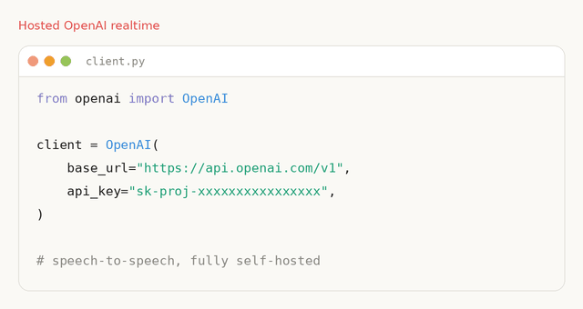

<div align="center">
  <div>&nbsp;</div>
  

# Speech To Speech: Build voice agents with open-source models

[](https://pypi.org/project/speech-to-speech/)
[](https://pypi.org/project/speech-to-speech/)
[](./LICENSE)

</div>

A low-latency, fully modular voice-agent pipeline: **VAD -> STT -> LLM -> TTS**, exposed through an **OpenAI Realtime-compatible WebSocket API**. Every component is swappable. The LLM slot speaks OpenAI-compatible protocols, so you can point it at a hosted provider, at [HF Inference Providers](https://huggingface.co/inference-providers), or at a vLLM or llama.cpp server on your own hardware for a fully local, fully open stack.

This pipeline runs in production as the conversation backend for thousands of [Reachy Mini](https://huggingface.co/blog/reachy-mini) robots.

<p align="center">
  <picture>
    <source media="(prefers-color-scheme: dark)" srcset="./docs/assets/endpoint-swap-dark.gif">
    <source media="(prefers-color-scheme: light)" srcset="./docs/assets/endpoint-swap-light.gif">
    
  </picture>
</p>

## Quickstart

```bash
pip install speech-to-speech
export OPENAI_API_KEY=...
speech-to-speech
```

This starts an OpenAI Realtime-compatible server at `ws://localhost:8765/v1/realtime` using Parakeet TDT for local STT, an OpenAI-compatible LLM, and Qwen3-TTS for local speech output.

From a source checkout, talk to it from a second terminal:

```bash
python scripts/listen_and_play_realtime.py --host 127.0.0.1 --port 8765
```

Prefer to keep the LLM on your own machine? Serve Gemma 4 with llama.cpp:

```bash
llama-server -hf ggml-org/gemma-4-E4B-it-GGUF -np 2 -c 65536 -fa on --swa-full
```

Then point the OpenAI-compatible LLM backend at it:

```bash
speech-to-speech \
    --model_name "ggml-org/gemma-4-E4B-it-GGUF" \
    --responses_api_base_url "http://127.0.0.1:8080/v1" \
    --responses_api_api_key ""
```

Any OpenAI Realtime-compatible client can connect. See [Realtime API](#realtime-api) for the protocol and [LLM backends](#llm-backends) for provider and local-server options.

## Index

* [How it works](#how-it-works)
* [Installation](#installation)
* [Supported components](#supported-components)
* [Run modes](#run-modes)
* [Realtime API](#realtime-api)
* [LLM backends](#llm-backends)
* [Multi-language support](#multi-language-support)
* [Pocket TTS](#pocket-tts)
* [CLI reference](#cli-reference)
* [Contributing](#contributing)
* [Citations](#citations)

## How it works

The pipeline is a cascade of four components, each running in its own thread and connected by queues:

1. **Voice Activity Detection (VAD)**: [Silero VAD v5](https://github.com/snakers4/silero-vad) detects speech boundaries and turn-taking.
2. **Speech to Text (STT)**: transcribes the user's turn, with optional live partial transcripts.
3. **Language Model (LLM)**: generates the response, streaming text and tool calls.
4. **Text to Speech (TTS)**: synthesizes audio and streams it back to the client.

Every stage has multiple interchangeable backends, selected via CLI flags. The code is designed for easy modification, with a focus on models available through Transformers and the Hugging Face Hub.

## Installation

Requires Python 3.10+.

```bash
pip install speech-to-speech
```

The default install covers the standard realtime path:

- Parakeet TDT for STT
- OpenAI-compatible API for the language model
- Qwen3-TTS for speech output, using the GGML backend by default on non-macOS platforms and `mlx-audio` on Apple Silicon
- local audio and realtime server modes

macOS and non-macOS dependencies are resolved automatically via platform markers in `pyproject.toml`.

### CUDA Note for Qwen3-TTS

On Linux, the Qwen3-TTS GGML backend comes from `faster-qwen3-tts[ggml]`. Its default `qwentts-cpp-python` wheel on PyPI targets CUDA 12.8. If your machine does not have the CUDA 12 runtime that wheel expects, install the matching wheel from the Hugging Face wheelhouse before installing `speech-to-speech`:

```bash
# CUDA 13.x
pip install "qwentts-cpp-python==0.3.0+cu130" \
  -f https://huggingface.co/datasets/andito/qwentts-cpp-python-wheels/tree/main/whl/cu130

# CUDA 12.4
pip install "qwentts-cpp-python==0.3.0+cu124" \
  -f https://huggingface.co/datasets/andito/qwentts-cpp-python-wheels/tree/main/whl/cu124

# CPU-only fallback
pip install "qwentts-cpp-python==0.3.0+cpu" \
  -f https://huggingface.co/datasets/andito/qwentts-cpp-python-wheels/tree/main/whl/cpu

pip install speech-to-speech
```

To use the previous CUDA-graphs implementation instead of GGML, pass `--qwen3_tts_backend torch`.

### Optional Backends

Extra backends are installed with pip extras:

```bash
pip install "speech-to-speech[kokoro]"          # Kokoro-82M TTS on non-macOS
pip install "speech-to-speech[pocket]"          # Pocket TTS
pip install "speech-to-speech[chattts]"         # ChatTTS
pip install "speech-to-speech[facebook-mms]"    # MMS TTS
pip install "speech-to-speech[faster-whisper]"  # Faster Whisper STT
pip install "speech-to-speech[whisper-mlx]"     # Lightning Whisper MLX STT on macOS
pip install "speech-to-speech[paraformer]"      # Paraformer STT through FunASR
pip install "speech-to-speech[sensevoice]"      # SenseVoice STT through FunASR
pip install "speech-to-speech[mlx-lm]"          # mlx-vlm support for vision models on macOS
```

Deprecated implementations, including MeloTTS, live in [`archive/`](./archive) and are no longer wired into the CLI.

**Note on DeepFilterNet:** DeepFilterNet, used for optional audio enhancement in VAD, requires `numpy<2` and conflicts with Pocket TTS, which requires `numpy>=2`. Install it manually only in environments where you are not using Pocket TTS.

### From Source

```bash
git clone https://github.com/huggingface/speech-to-speech.git
cd speech-to-speech
uv sync
```

This installs the package in editable mode and makes the `speech-to-speech` CLI available.

## Supported Components

| Component | Backend | Platforms | Install |
|---|---|---|---|
| VAD | [Silero VAD v5](https://github.com/snakers4/silero-vad) | all | built-in |
| STT | [Parakeet TDT](https://huggingface.co/nvidia/parakeet-tdt-0.6b-v3) (default) | CUDA / CPU through nano-parakeet, Apple Silicon through MLX | built-in |
| STT | [Whisper](https://huggingface.co/docs/transformers/en/model_doc/whisper) through Transformers | CUDA / CPU | built-in |
| STT | [Faster Whisper](https://github.com/SYSTRAN/faster-whisper) | CUDA / CPU | `faster-whisper` |
| STT | [Lightning Whisper MLX](https://github.com/mustafaaljadery/lightning-whisper-mlx) | Apple Silicon | `whisper-mlx` |
| STT | [MLX Audio Whisper](https://github.com/huggingface/mlx-audio) | Apple Silicon | built-in on macOS |
| STT | [Paraformer](https://github.com/modelscope/FunASR) | CUDA / CPU | `paraformer` |
| STT | [SenseVoice](https://github.com/FunAudioLLM/SenseVoice) through FunASR | CUDA / CPU | `sensevoice` |
| LLM | OpenAI-compatible API (`responses-api`, `chat-completions`) | hosted providers or self-hosted servers | built-in |
| LLM | [Transformers](https://huggingface.co/models?pipeline_tag=text-generation&sort=trending) | CUDA / CPU | built-in |
| LLM | [mlx-lm](https://github.com/ml-explore/mlx-lm) | Apple Silicon | built-in on macOS |
| TTS | [Qwen3-TTS](https://huggingface.co/Qwen/Qwen3-TTS-12Hz-1.7B-CustomVoice) (default) | GGML / CUDA on Linux, mlx-audio on macOS | built-in |
| TTS | [Kokoro-82M](https://huggingface.co/hexgrad/Kokoro-82M) | CUDA / CPU, Apple Silicon | `kokoro` on non-macOS; built-in on macOS |
| TTS | [Pocket TTS](https://github.com/kyutai-labs/pocket-tts) | CPU / CUDA | `pocket` |
| TTS | [ChatTTS](https://github.com/2noise/ChatTTS) | CUDA / CPU | `chattts` |
| TTS | [MMS TTS](https://huggingface.co/docs/transformers/model_doc/mms) | CUDA / CPU | `facebook-mms` |

Select implementations with `--stt`, `--llm_backend`, and `--tts`. Run `speech-to-speech -h` for exact values and backend-specific flags.

## Run Modes

| Mode | Transport | Use it when |
|---|---|---|
| `realtime` (default) | WebSocket, OpenAI Realtime protocol at `/v1/realtime` | You are building an app or device against a standard voice API. |
| `local` | Your machine's microphone and speakers | You want to talk to the pipeline directly, no client needed. |
| `websocket` | Raw PCM over WebSocket | You want a minimal custom client without the Realtime protocol. |
| `socket` | Raw PCM over TCP | Models run on a remote server, with a simple microphone/playback client. |

### Realtime Server

```bash
export OPENAI_API_KEY=...
speech-to-speech
```

This is equivalent to:

```bash
speech-to-speech \
    --thresh 0.6 \
    --stt parakeet-tdt \
    --llm_backend responses-api \
    --tts qwen3 \
    --qwen3_tts_model_name Qwen/Qwen3-TTS-12Hz-1.7B-CustomVoice \
    --qwen3_tts_speaker Aiden \
    --qwen3_tts_language auto \
    --qwen3_tts_backend ggml \
    --qwen3_tts_non_streaming_mode True \
    --qwen3_tts_mlx_quantization 6bit \
    --model_name gpt-5.4-mini \
    --chat_size 30 \
    --responses_api_stream \
    --enable_live_transcription \
    --mode realtime
```

The default model is `gpt-5.4-mini` through the OpenAI Responses API. Override it with `--model_name`, and set `--responses_api_base_url` for another OpenAI-compatible provider or server.

### Local Mac

```bash
speech-to-speech --local_mac_optimal_settings
```

Optionally with a specific LLM:

```bash
speech-to-speech \
    --local_mac_optimal_settings \
    --model_name mlx-community/Qwen3-4B-Instruct-2507-bf16
```

This setting:

- Adds `--device mps` to use MPS for all models.
- Sets Parakeet TDT for STT.
- Sets MLX LM as the LLM backend.
- Sets Qwen3-TTS for TTS, using `mlx-audio` with the `6bit` MLX variant by default.
- Sets `--mode local`.

`--tts pocket` and `--tts kokoro` are also valid on macOS.

To compare the MLX quantization variants locally:

```bash
python scripts/benchmark_tts.py \
    --handlers qwen3 \
    --iterations 3 \
    --qwen3_mlx_quantizations bf16 4bit 6bit 8bit
```

### WebSocket

1. Run the pipeline in WebSocket mode:

   ```bash
   speech-to-speech --mode websocket --ws_host 0.0.0.0 --ws_port 8765
   ```

2. Connect from your client at `ws://<server-ip>:8765`. Send raw audio bytes as 16 kHz, int16, mono PCM and receive generated audio bytes back.

### TCP Socket

TCP socket mode is intentionally minimal. It streams raw PCM audio, but does not provide the full Realtime API feature set, including interruption handling, live transcript events, or tool-call events.

1. Run the pipeline on the server:

   ```bash
   speech-to-speech --mode socket --recv_host 0.0.0.0 --send_host 0.0.0.0
   ```

2. Run the client locally to handle microphone input and playback:

   ```bash
   python scripts/listen_and_play.py --host <IP address of your server>
   ```

### Docker

Install the [NVIDIA Container Toolkit](https://docs.nvidia.com/datacenter/cloud-native/container-toolkit/latest/install-guide.html), then:

```bash
docker compose up
```

The compose file starts a llama.cpp server with Gemma 4, starts the TCP socket server, and exposes ports `8080`, `12345`, and `12346`.

## Realtime API

Realtime mode streams audio over a WebSocket using the OpenAI Realtime protocol, with live transcription and low-latency turn-taking. The server exposes `/v1/realtime`, and any OpenAI Realtime-compatible client can connect:

```python
from openai import OpenAI

client = OpenAI(
    base_url="http://localhost:8765/v1",
    websocket_base_url="ws://localhost:8765/v1",
    api_key="not-needed",
)

with client.realtime.connect(model="local") as conn:
    conn.send(
        {
            "type": "session.update",
            "session": {
                "type": "realtime",
                "instructions": "You are a helpful assistant.",
                "audio": {
                    "input": {
                        "turn_detection": {
                            "type": "server_vad",
                            "interrupt_response": True,
                        }
                    }
                },
            },
        }
    )

    for event in conn:
        print(event.type)
```

The server implements the core Realtime event set: `input_audio_buffer.append`, `session.update`, `conversation.item.create`, `response.create`, and `response.cancel` inbound; speech start/stop, streaming transcription, audio deltas, tool calls, and `response.done` outbound. The full event reference, architecture, and design details live in the [Realtime Engine README](./src/speech_to_speech/api/openai_realtime/README.md).

## LLM Backends

The LLM is the most compute-intensive and highest-latency component in the pipeline. A single forward pass through a large model can dominate end-to-end response time, so choosing the right backend for your hardware and latency budget matters. The pipeline supports:

- **Local inference**: `transformers` on CUDA / CPU and `mlx-lm` on Apple Silicon.
- **Self-hosted servers**: `responses-api` and `chat-completions` can point at a local [vLLM](https://github.com/vllm-project/vllm) or [llama.cpp](https://github.com/ggerganov/llama.cpp) server.
- **Provider APIs**: the same backends work with OpenAI, [HF Inference Providers](https://huggingface.co/inference-providers), [OpenRouter](https://openrouter.ai), and other OpenAI-compatible providers.

Two API backends are available, sharing the same `--responses_api_*` connection flags:

- `--llm_backend responses-api` (default) targets `/v1/responses`.
- `--llm_backend chat-completions` targets `/v1/chat/completions`.

The examples below pair Parakeet TDT for local STT and Qwen3-TTS for local TTS with different LLM backends.

### Responses API Backend

Works with any provider or server that implements the OpenAI Responses API. Point `--responses_api_base_url` at the endpoint and set `--model_name` accordingly:

| Provider / server | `--responses_api_base_url` | `--responses_api_api_key` |
|---|---|---|
| OpenAI | omit, uses OpenAI default | `$OPENAI_API_KEY` |
| HF Inference Providers | `https://router.huggingface.co/v1` | `$HF_TOKEN` |
| OpenRouter | `https://openrouter.ai/api/v1` | `$OPENROUTER_API_KEY` |
| vLLM | `http://localhost:8000/v1` | omit or any string |
| llama.cpp | `http://127.0.0.1:8080/v1` | empty string |

```bash
# OpenAI
speech-to-speech \
    --mode local \
    --stt parakeet-tdt \
    --llm_backend responses-api \
    --tts qwen3 \
    --qwen3_tts_mlx_quantization 6bit \
    --model_name "gpt-4o-mini" \
    --responses_api_api_key "$OPENAI_API_KEY" \
    --responses_api_stream \
    --enable_live_transcription
```

```bash
# HF Inference Providers: Qwen3.5-9B via Together
speech-to-speech \
    --mode local \
    --stt parakeet-tdt \
    --llm_backend responses-api \
    --tts qwen3 \
    --qwen3_tts_mlx_quantization 6bit \
    --model_name "Qwen/Qwen3.5-9B:together" \
    --responses_api_base_url "https://router.huggingface.co/v1" \
    --responses_api_api_key "$HF_TOKEN" \
    --responses_api_stream \
    --enable_live_transcription
```

```bash
# HF Inference Providers: GPT-oss-20B via Groq
speech-to-speech \
    --stt parakeet-tdt \
    --llm_backend responses-api \
    --tts qwen3 \
    --qwen3_tts_mlx_quantization 6bit \
    --model_name "openai/gpt-oss-20b:groq" \
    --responses_api_base_url "https://router.huggingface.co/v1" \
    --responses_api_api_key "$HF_TOKEN" \
    --responses_api_stream \
    --enable_live_transcription
```

### Chat Completions Backend

Identical configuration to `responses-api`, reusing the same `--responses_api_*` connection flags, but talks to `/v1/chat/completions` instead of `/v1/responses`. Prefer it when:

- the provider ignores `chat_template_kwargs.enable_thinking` on the Responses path and needs a `reasoning_effort` knob to suppress reasoning, or
- the server's Responses streaming tool-call path is unreliable, while its Chat Completions tool-call streaming is solid. This is useful for some vLLM builds; see [#312](https://github.com/huggingface/speech-to-speech/issues/312).

Add `--responses_api_reasoning_effort none` to disable reasoning on providers where the chat-template flag has no effect:

```bash
# vLLM serving a Qwen model with tool calling
speech-to-speech \
    --mode realtime \
    --stt parakeet-tdt \
    --llm_backend chat-completions \
    --tts qwen3 \
    --model_name "Qwen/Qwen3-4B-Instruct-2507" \
    --responses_api_base_url "http://localhost:8000/v1" \
    --responses_api_stream
```

```bash
# Gemma 4 31B via the HF router on Cerebras, with reasoning disabled for low voice latency
speech-to-speech \
    --mode realtime \
    --stt parakeet-tdt \
    --llm_backend chat-completions \
    --tts qwen3 \
    --model_name "google/gemma-4-31B-it:cerebras" \
    --responses_api_base_url "https://router.huggingface.co/v1" \
    --responses_api_api_key "$HF_TOKEN" \
    --responses_api_reasoning_effort none \
    --responses_api_stream
```

### Fully Local

Run the LLM in a separate llama.cpp process for the lowest-friction fully local setup, as shown in the [Reachy Mini local conversation guide](https://huggingface.co/blog/local-reachy-mini-conversation):

```bash
# Terminal 1: llama.cpp serving Gemma 4
llama-server -hf ggml-org/gemma-4-E4B-it-GGUF -np 2 -c 65536 -fa on --swa-full
```

```bash
# Terminal 2: speech-to-speech using that local LLM server
speech-to-speech \
    --mode realtime \
    --stt parakeet-tdt \
    --llm_backend responses-api \
    --tts qwen3 \
    --model_name "ggml-org/gemma-4-E4B-it-GGUF" \
    --responses_api_base_url "http://127.0.0.1:8080/v1" \
    --responses_api_api_key "" \
    --responses_api_stream \
    --enable_live_transcription
```

You can use `--mode local` instead of `--mode realtime` when you want to talk through the machine running the server directly. In-process local backends are still available with `--llm_backend mlx-lm` on Apple Silicon or `--llm_backend transformers` on CUDA / CPU.

## Multi-Language Support

Language coverage depends on the STT and TTS backends you pick, not on the pipeline itself:

| Component | Backend | Languages |
|---|---|---|
| STT | Parakeet TDT (default) | 25 European languages |
| STT | Whisper / Whisper MLX / Faster Whisper | Broad multilingual coverage, depending on the selected Whisper checkpoint |
| STT | Paraformer | Depends on the selected FunASR checkpoint; the default is Chinese-oriented |
| STT | SenseVoice | 50+ languages, with optional language/emotion/audio-event tags depending on the selected checkpoint |
| TTS | Qwen3-TTS (default) | Multilingual, with `--qwen3_tts_language auto` by default |
| TTS | Kokoro | Multiple language/voice mappings, depending on backend availability |
| TTS | ChatTTS | English and Chinese |
| TTS | MMS TTS | Broad multilingual coverage through MMS checkpoints |

Make sure the STT, LLM, and TTS you pair all cover your target language(s). Two usage patterns:

- **Single language**: set `--language` to the target language code. The default is `en`.
- **Language switching**: set `--language auto`. The STT detects the language of each spoken prompt and forwards it to the LLM. Optionally add `--enable_lang_prompt` to append a "Please reply to my message in ..." instruction. It defaults to `False`; large LLMs usually infer the language from context, but the explicit instruction can help smaller models.

Automatic language detection:

```bash
speech-to-speech \
    --stt parakeet-tdt \
    --language auto \
    --llm_backend mlx-lm \
    --model_name "mlx-community/Qwen3-4B-Instruct-2507-bf16"
```

A single non-English language, Chinese in this example:

```bash
speech-to-speech \
    --stt whisper-mlx \
    --stt_model_name large-v3 \
    --language zh \
    --llm_backend mlx-lm \
    --model_name mlx-community/Qwen3-4B-Instruct-2507-bf16
```

Both commands also work on top of `--local_mac_optimal_settings`; explicit `--stt` flags override the defaults it sets.

## Pocket TTS

Pocket TTS from Kyutai Labs provides streaming TTS with voice cloning:

```bash
speech-to-speech \
    --tts pocket \
    --pocket_tts_voice jean \
    --pocket_tts_device cpu
```

Available voice presets: `alba`, `marius`, `javert`, `jean`, `fantine`, `cosette`, `eponine`, `azelma`. Custom voice files and Hugging Face paths also work.

## CLI Reference

References for all CLI arguments live in the [arguments classes](./src/speech_to_speech/arguments_classes) and in `speech-to-speech -h`.

### Module-Level Parameters

See [ModuleArguments](./src/speech_to_speech/arguments_classes/module_arguments.py). It allows setting:

- a common `--device`, if every part should run on the same device
- `--mode`: `realtime` (default), `local`, `socket`, or `websocket`
- STT implementation (`--stt`)
- LLM backend (`--llm_backend`: `transformers`, `mlx-lm`, `responses-api`, or `chat-completions`)
- TTS implementation (`--tts`)
- logging level
- realtime pipeline pool size (`--num_pipelines`)

### VAD Parameters

See [VADHandlerArguments](./src/speech_to_speech/arguments_classes/vad_arguments.py). Notable options:

- `--thresh`: threshold value to trigger voice activity detection.
- `--min_speech_ms`: minimum duration of detected voice activity to be considered speech.
- `--min_speech_continuation_ms`: sustain-bar hysteresis threshold for speech that continues a reopenable soft-ended, uncommitted turn within the reopen window. The default and recommended pairing is `--min_speech_ms 384 --min_speech_continuation_ms 192`.
- `--min_silence_ms`: minimum length of silence intervals for segmenting speech. Default is 64 ms.
- `--short_segment_merge_ms`: optional merge window for stitching adjacent VAD segments that are each shorter than `--min_speech_ms`.
- `--unanswered_reopen_ms`: sanity cap on how long a soft-ended speculative turn that has not yet received any assistant output stays reopenable.

### STT, LLM, and TTS Parameters

`model_name`, `torch_dtype`, and `device` are exposed for each STT, LLM, and TTS implementation. STT and TTS parameters use the handler prefix, for example `--stt_model_name` or `--qwen3_tts_device`. LLM model selection and chat settings are shared across backends via unprefixed flags, for example `--model_name` and `--chat_size`; backend-specific flags use the `responses_api_` prefix for the `responses-api` and `chat-completions` backends and the `llm_` prefix for local backends.

For example:

```bash
# Local transformers/mlx-lm backend
--model_name google/gemma-2b-it

# OpenAI-compatible backend
--llm_backend responses-api --model_name deepseek-chat --responses_api_base_url https://api.deepseek.com
```

### Generation Parameters

Other generation parameters can be set using the handler prefix plus `_gen_`, for example `--stt_gen_max_new_tokens 128` or `--llm_gen_temperature 0.7`. Parameters not yet exposed can be added to the relevant arguments class.

## Contributing

Issues and PRs are welcome. Good starting points are the [open issues](https://github.com/huggingface/speech-to-speech/issues). For larger changes, open an issue first to discuss the approach.

For local development:

```bash
uv sync
pytest
ruff check
```

## Citations

If you use this pipeline, please also cite the component models you run. The defaults are:

### Silero VAD

```bibtex
@misc{SileroVAD,
  author = {Silero Team},
  title = {Silero VAD: pre-trained enterprise-grade Voice Activity Detector (VAD), Number Detector and Language Classifier},
  year = {2021},
  publisher = {GitHub},
  journal = {GitHub repository},
  howpublished = {\url{https://github.com/snakers4/silero-vad}},
  email = {hello@silero.ai}
}
```

### Parakeet TDT

```bibtex
@misc{parakeet-tdt,
  author = {NVIDIA},
  title = {Parakeet TDT 0.6B v3},
  publisher = {Hugging Face},
  howpublished = {\url{https://huggingface.co/nvidia/parakeet-tdt-0.6b-v3}}
}
```

### Qwen3-TTS

```bibtex
@misc{qwen3-tts,
  author = {Qwen Team},
  title = {Qwen3-TTS},
  publisher = {Hugging Face},
  howpublished = {\url{https://huggingface.co/Qwen/Qwen3-TTS-12Hz-1.7B-CustomVoice}}
}
```

Citations for optional backends such as Kokoro, Pocket TTS, ChatTTS, Whisper variants, Paraformer, and MMS live in the respective [component READMEs](./src/speech_to_speech).
