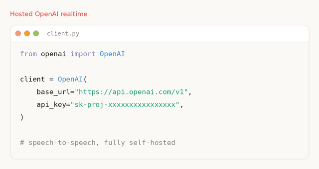

<div align="center">
  <div>&nbsp;</div>
  

# Speech To Speech: Build voice agents with open-source models

<p>
  <a href="https://trendshift.io/repositories/20645"></a>
</p>

[](https://pypi.org/project/speech-to-speech/)
[](https://pypi.org/project/speech-to-speech/)
[](./LICENSE)

</div>

A low-latency, fully modular voice-agent pipeline: **VAD -> STT -> LLM -> TTS**, exposed through the **core OpenAI Realtime GA event set over WebSocket and WebRTC**. Every component is swappable. The LLM slot speaks OpenAI-compatible protocols, so you can point it at a hosted provider, at [HF Inference Providers](https://huggingface.co/inference-providers), or at a vLLM or llama.cpp server on your own hardware for a fully local, fully open stack.

This pipeline runs in production as the conversation backend for thousands of [Reachy Mini](https://huggingface.co/blog/reachy-mini) robots.

<p align="center">
  <picture>
    <source media="(prefers-color-scheme: dark)" srcset="./docs/assets/endpoint-swap-dark.gif">
    <source media="(prefers-color-scheme: light)" srcset="./docs/assets/endpoint-swap-light.gif">
    
  </picture>
</p>

## Quickstart

Choose where the language model should run. All three configurations use local Parakeet TDT speech recognition and Qwen3-TTS speech output **by default**. You can change the STT, LLM, and TTS models and backends; see [Supported components](#supported-components). Each configuration runs from one terminal with the packaged microphone/speaker client.

| Starting configuration | Hardware to plan for | Conversation data sent to a provider |
|---|---|---|
| [Apple Silicon, fully local](#apple-silicon-fully-local) | Apple Silicon Mac; budget 16 GB or more of unified memory | None |
| [NVIDIA GPU, fully local](#nvidia-gpu-fully-local) | Linux with an NVIDIA GPU; budget 24 GB of VRAM for the unquantized LLM, speech models, and caches below, plus system RAM | None |
| [Local speech with a hosted LLM](#local-speech-with-a-hosted-llm) | Apple Silicon: budget ~8 GB of available unified memory (16 GB total recommended); Linux/NVIDIA: ~8 GB of available VRAM, plus system RAM | Transcribed text, instructions, and conversation history; microphone audio stays local |

The memory figures are planning estimates for one conversation, not measured minimum requirements. Actual use depends on context length, audio length, and backend versions. All configurations need internet access for the first model downloads; the hosted LLM also needs an API key and internet access during conversations.

### Install for these examples

Use Python 3.10+ (Python 3.11 recommended) and install the package in a virtual environment.

On Ubuntu, install the local audio libraries first: `sudo apt-get install libportaudio2 libsndfile1`. The default Linux Qwen3-TTS wheel targets CUDA 12.8 and glibc 2.39 (Ubuntu 24.04); check the [CUDA installation note](#cuda-note-for-qwen3-tts) if your system differs.

```bash
python3 -m venv .venv
source .venv/bin/activate
pip install speech-to-speech
```

Run the configuration you chose with this environment activated. Activate the same environment in any additional terminal where you run `speech-to-speech`. The first run downloads and warms up the models before connecting the microphone. Allow microphone access if prompted, use headphones to avoid speaker feedback, then speak and pause for a reply. Stop with `Ctrl+C`.

If speaker feedback interrupts replies, add `--local_audio_block_mic_during_playback` to your `speech-to-speech local` command. This pauses microphone capture during playback, so you cannot interrupt the assistant while it speaks.

### Apple Silicon, fully local

Run all three models locally on an Apple Silicon Mac, using a quantized LLM through MLX. No API key is needed.

```bash
speech-to-speech local \
    --mac-optimal-settings \
    --model_name mlx-community/Qwen3-4B-Instruct-2507-4bit
```

The Mac preset selects Parakeet TDT through MLX, the 4-bit Qwen3-4B language model through MLX LM, and the 6-bit Qwen3-TTS CustomVoice model through MLX Audio. The core model weights total approximately **7.5 GB**: [STT](https://huggingface.co/mlx-community/parakeet-tdt-0.6b-v3/tree/main), [LLM](https://huggingface.co/mlx-community/Qwen3-4B-Instruct-2507-4bit/tree/main), and [TTS](https://huggingface.co/mlx-community/Qwen3-TTS-12Hz-1.7B-CustomVoice-6bit/tree/main). Allow additional disk space for dependencies and auxiliary model assets.

For a separate local LLM server, see [Combining with llama.cpp](#combining-with-llamacpp). For a model that accepts audio directly, see the [Gemma 4 12B example](./examples/gemma4-12b-macos/README.md).

### NVIDIA GPU, fully local

Run all three models locally on a Linux workstation with a CUDA-capable NVIDIA GPU. Transformers loads the LLM in the speech process, so no separate LLM server or API key is needed.

```bash
speech-to-speech local \
    --device cuda \
    --stt parakeet-tdt \
    --llm_backend transformers \
    --model_name Qwen/Qwen3-4B-Instruct-2507 \
    --llm_torch_dtype float16 \
    --tts qwen3 \
    --qwen3_tts_backend ggml
```

The [LLM weights alone are approximately **8 GB**](https://huggingface.co/Qwen/Qwen3-4B-Instruct-2507/tree/main); speech models, caches, and dependencies need additional disk space. For a quantized LLM in a separate server, see [Combining with llama.cpp](#combining-with-llamacpp), available on both Apple Silicon and NVIDIA.

### Local speech with a hosted LLM

Run speech recognition and synthesis locally on Apple Silicon or Linux/NVIDIA while a hosted LLM generates replies. The speech backends select MLX automatically on Apple Silicon.

Budget approximately **8 GB of available memory for the local speech pipeline**: unified memory on Apple Silicon (**16 GB total recommended**) or GPU VRAM on NVIDIA, with separate system RAM. Leave room for the operating system and other apps.

```bash
export OPENAI_API_KEY=...
speech-to-speech local \
    --stt parakeet-tdt \
    --llm_backend responses-api \
    --tts qwen3
```

This uses the default OpenAI model described under [Realtime Server](#realtime-server), with provider API charges. Only the speech models download locally: approximately **5.2 GB** of core weights on Apple Silicon, plus dependencies and auxiliary assets; Linux uses different speech-model formats and caches. Transcribed text, instructions, and conversation history are sent to OpenAI. Microphone audio and speech synthesis remain on your computer in this configuration. For another provider, see [LLM backends](#llm-backends).

### Other clients and offline use

For offline use, first cache the selected models and dependencies as described in [Offline operation](#offline-operation).

To connect an app instead of the packaged microphone client, replace `local` with `serve` in your chosen speech-to-speech command, keeping any separate LLM server running. The speech server listens at `ws://127.0.0.1:8765/v1/realtime`. You can then connect from another terminal with the same Python environment activated:

```bash
speech-to-speech talk --url ws://127.0.0.1:8765/v1/realtime
```

For a browser interface, start your chosen configuration with `serve`, then follow the [browser demo setup](./demo/README.md#quick-start-local) using that running backend.

Clients using the implemented core Realtime event set can connect. The official OpenAI Agents SDK is tested over both stock transports; see [Realtime API](#realtime-api) for the tested surface and [LLM backends](#llm-backends) for provider and local-server options.

## Index

* [How it works](#how-it-works)
* [Starting configurations](#quickstart)
* [Installation](#installation)
* [Offline operation](#offline-operation)
* [Supported components](#supported-components)
* [Commands](#commands)
* [Realtime API](#realtime-api)
* [LLM backends](#llm-backends)
* [Multi-language support](#multi-language-support)
* [OmniVoice](#omnivoice)
* [Pocket TTS](#pocket-tts)
* [CLI reference](#cli-reference)
* [Contributing](#contributing)
* [Star history](#star-history)
* [Citations](#citations)

## How it works

The pipeline is a cascade of four components, each running in its own thread and connected by queues:

1. **Voice Activity Detection (VAD)**: [Silero VAD v5](https://github.com/snakers4/silero-vad) detects speech boundaries and turn-taking.
2. **Speech to Text (STT)**: transcribes the user's turn, with optional live partial transcripts.
3. **Language Model (LLM)**: generates the response, streaming text and tool calls.
4. **Text to Speech (TTS)**: synthesizes audio and streams it back to the client.

Every stage has multiple interchangeable backends, selected via CLI flags. The code is designed for easy modification, with a focus on models available through Transformers and the Hugging Face Hub.

## Installation

Requires Python 3.10+. Install from PyPI in an activated virtual environment (see the [quickstart setup](#install-for-these-examples)):

```bash
pip install speech-to-speech
```

The default install covers the standard realtime path:

- Parakeet TDT for STT
- OpenAI-compatible API for the language model
- Qwen3-TTS for speech output, using the GGML backend by default on non-macOS platforms and `mlx-audio` on Apple Silicon
- local audio and realtime server modes

macOS and non-macOS dependencies are resolved automatically via platform markers in `pyproject.toml`.

### CUDA Note for Qwen3-TTS

On Linux, the Qwen3-TTS GGML backend comes from `faster-qwen3-tts[ggml]`. Its default `qwentts-cpp-python` wheel on PyPI targets CUDA 12.8 and `manylinux_2_39` (for example, Ubuntu 24.04). If your CUDA runtime or glibc is older, install the matching wheel from the Hugging Face wheelhouse before installing `speech-to-speech`:

```bash
# CUDA 13.x
pip install "qwentts-cpp-python==0.3.1+cu130" \
  -f https://huggingface.co/datasets/andito/qwentts-cpp-python-wheels/tree/main/whl/cu130

# CUDA 12.4
pip install "qwentts-cpp-python==0.3.1+cu124" \
  -f https://huggingface.co/datasets/andito/qwentts-cpp-python-wheels/tree/main/whl/cu124

# CPU-only fallback
pip install "qwentts-cpp-python==0.3.1+cpu" \
  -f https://huggingface.co/datasets/andito/qwentts-cpp-python-wheels/tree/main/whl/cpu

pip install speech-to-speech
```

To use the previous CUDA-graphs implementation instead of GGML, pass `--qwen3_tts_backend torch`.

### Optional Components

Optional components are installed with pip extras:

```bash
pip install "speech-to-speech[kokoro]"          # Kokoro-82M TTS on non-macOS
pip install "speech-to-speech[pocket]"          # Pocket TTS
pip install "speech-to-speech[chattts]"         # ChatTTS
pip install "speech-to-speech[omnivoice]"       # OmniVoice TTS (CUDA, Intel XPU, or Apple Silicon)
pip install "speech-to-speech[faster-whisper]"  # Faster Whisper STT
pip install "speech-to-speech[whisper-mlx]"     # Lightning Whisper MLX STT on macOS
pip install "speech-to-speech[paraformer]"      # Paraformer STT through FunASR
pip install "speech-to-speech[mlx-lm]"          # mlx-vlm support for vision models on macOS
```

Deprecated implementations, including MeloTTS, live in [`archive/`](./archive) and are no longer wired into the CLI.

**Note on DeepFilterNet:** DeepFilterNet, used for optional audio enhancement in VAD, requires `numpy<2` and conflicts with Pocket TTS, which requires `numpy>=2`. Install it manually only in environments where you are not using Pocket TTS.

### From Source

To work on the code, install [Git](https://git-scm.com/downloads) and [uv](https://docs.astral.sh/uv/getting-started/installation/), then run:

```bash
git clone https://github.com/huggingface/speech-to-speech.git
cd speech-to-speech
uv sync --python 3.11
source .venv/bin/activate
```

This installs the package in editable mode. With the environment activated, use the same `speech-to-speech` commands shown above.

## Supported Components

| Component | Backend | Platforms | Install |
|---|---|---|---|
| VAD | [Silero VAD v5](https://github.com/snakers4/silero-vad) | all | built-in |
| STT | [Parakeet TDT](https://huggingface.co/nvidia/parakeet-tdt-0.6b-v3) (default) | CUDA / CPU through nano-parakeet, Apple Silicon through MLX | built-in |
| STT | [Whisper](https://huggingface.co/docs/transformers/en/model_doc/whisper) through Transformers | CUDA / CPU | built-in |
| STT | [Faster Whisper](https://github.com/SYSTRAN/faster-whisper) | CUDA / CPU | `faster-whisper` |
| STT | [Lightning Whisper MLX](https://github.com/mustafaaljadery/lightning-whisper-mlx) | Apple Silicon | `whisper-mlx` |
| STT | [MLX Audio Whisper](https://github.com/huggingface/mlx-audio) | Apple Silicon | built-in on macOS |
| STT | [Paraformer](https://github.com/modelscope/FunASR) | CUDA / CPU | `paraformer` |
| STT | [Qwen3-ASR](https://huggingface.co/Qwen/Qwen3-ASR-0.6B-hf) through Transformers | CUDA / CPU, Apple Silicon | built-in |
| STT | OpenAI-compatible `/v1/audio/transcriptions` endpoint | local or remote HTTP server | built-in |
| STT | OpenAI Realtime transcription | hosted or compatible WebSocket server | built-in |
| STT | vLLM Realtime transcription (experimental) | local or remote vLLM server | built-in |
| LLM | OpenAI-compatible API (`responses-api`, `chat-completions`) | hosted providers or self-hosted servers | built-in |
| LLM | [Transformers](https://huggingface.co/models?pipeline_tag=text-generation&sort=trending) | CUDA / CPU | built-in |
| LLM | [mlx-lm](https://github.com/ml-explore/mlx-lm) | Apple Silicon | built-in on macOS |
| TTS | [Qwen3-TTS](https://huggingface.co/Qwen/Qwen3-TTS-12Hz-1.7B-CustomVoice) (default) | GGML / CUDA on Linux, mlx-audio on macOS | built-in |
| TTS | [Kokoro-82M](https://huggingface.co/hexgrad/Kokoro-82M) | CUDA / CPU, Apple Silicon | `kokoro` on non-macOS; built-in on macOS |
| TTS | [Pocket TTS](https://github.com/kyutai-labs/pocket-tts) | CPU / CUDA | `pocket` |
| TTS | [ChatTTS](https://github.com/2noise/ChatTTS) | CUDA / CPU | `chattts` |
| TTS | [OmniVoice](https://huggingface.co/k2-fsa/OmniVoice) | CUDA / Intel XPU / Apple Silicon | `omnivoice` |
| TTS | [MMS TTS](https://huggingface.co/docs/transformers/model_doc/mms) | CUDA / CPU | built-in |
| TTS | OpenAI-compatible `/v1/audio/speech` endpoint | local or remote HTTP server | built-in |

Select implementations with `--stt`, `--llm_backend`, and `--tts`. The CLI constructs configuration only for the selected backends; known options for inactive backends remain accepted for compatibility but are ignored with a warning. JSON configuration may likewise include extra inactive-backend keys, which are ignored. Run `speech-to-speech serve -h` for the defaults, or pass selectors before `-h` to see another combination's backend-specific flags (for example, `speech-to-speech serve --stt mlx-audio-whisper -h`).

For client-only TTS serving with vLLM-Omni or another compatible server, see
[OpenAI-compatible TTS](./docs/openai-compatible-tts.md).

For client-only speech recognition with vLLM, OpenAI's hosted Transcription API,
or another compatible server, see
[OpenAI-compatible STT](./docs/openai-compatible-stt.md).
For native incremental audio and partial transcripts, see
[stateful streaming STT](./docs/openai-compatible-stt.md#stateful-streaming-stt).

## Commands

| Command | Behavior | Use it when |
|---|---|---|
| `serve` | Runs the pipeline server over OpenAI Realtime WebSocket and WebRTC. | You are building an app or device against the API. |
| `talk --url <full-realtime-url>` | Runs the packaged microphone/speaker client. | You want to talk to an existing Realtime server. |
| `local` | Composes `serve` and `talk` in-process over loopback. | You want to run the server and talk to it from one command. |

`serve` binds to `127.0.0.1` by default; pass `--host 0.0.0.0` explicitly for network exposure. `local` always binds to loopback and connects the same packaged client at `ws://127.0.0.1:<port>/v1/realtime`.

The packaged `local` client buffers 196 ms of received audio when using the
OpenAI-compatible TTS backend, which absorbs short delivery gaps from HTTP
speech inference. Other `local` backends and `talk` start playback immediately
by default. Use `--playback-buffer-ms <milliseconds>` to override either
default: a larger value resists stuttering but delays the start of each
response, while a smaller value starts sooner but is more sensitive to jitter.
This setting only controls the packaged Python client's speakers; browser and
other Realtime clients manage their own playback buffers.

The packaged client can opt in to local Python tools with `talk --tool-module <module>` or `local --tool-module <module>`. The module contract, programmatic API, and a Serper web-search example are documented in [Tool calling design](./src/speech_to_speech/api/openai_realtime/README.md#packaged-python-client-tools).

### Migrating from `--mode`

`--mode` is deprecated and will stop working soon. During this migration window, `speech-to-speech --mode realtime` runs `speech-to-speech serve`, and `speech-to-speech --mode local` runs `speech-to-speech local`; both print a warning. All other mode values have been removed and exit with guidance to use the new commands.

### Realtime Server

```bash
export OPENAI_API_KEY=...
speech-to-speech serve
```

This is equivalent to:

```bash
speech-to-speech serve \
    --thresh 0.6 \
    --stt parakeet-tdt \
    --llm_backend responses-api \
    --tts qwen3 \
    --qwen3_tts_model_name Qwen/Qwen3-TTS-12Hz-1.7B-CustomVoice \
    --qwen3_tts_speaker Aiden \
    --qwen3_tts_language auto \
    --qwen3_tts_backend ggml \
    --qwen3_tts_non_streaming_mode True \
    --qwen3_tts_mlx_quantization 6bit \
    --model_name gpt-5.6-terra \
    --chat_size 30 \
    --responses_api_stream \
    --enable_live_transcription
```

The default model is `gpt-5.6-terra` through the OpenAI Responses API with reasoning effort `none`, preserving the previous default model's latency-oriented reasoning behavior. Override the model with `--model_name`, the effort with `--responses_api_reasoning_effort`, and set `--responses_api_base_url` for another OpenAI-compatible provider or server.

### Local Mac

Start with [Apple Silicon, fully local](#apple-silicon-fully-local). Its `--mac-optimal-settings` preset supplies MPS defaults for supported components, Parakeet TDT for STT, MLX LM for the LLM, and Qwen3-TTS through `mlx-audio` with the `6bit` variant.

The preset supplies these as defaults only: explicit `--device`, component-device flags such as `--qwen3_tts_device`, and `--stt`, `--llm_backend`, `--model_name`, and `--tts` all win. Use it with `serve` instead of `local` when you want to expose the server without starting the microphone/speaker client.

`--tts pocket`, `--tts kokoro`, and `--tts omnivoice` are also valid on macOS.

To compare the MLX quantization variants locally:

```bash
python scripts/benchmark_tts.py \
    --handlers qwen3 \
    --iterations 3 \
    --qwen3_mlx_quantizations bf16 4bit 6bit 8bit
```

### Docker

Install the [NVIDIA Container Toolkit](https://docs.nvidia.com/datacenter/cloud-native/container-toolkit/latest/install-guide.html), then:

```bash
docker compose up
```

The compose file starts a llama.cpp server with Gemma 4 and the Realtime server, exposing ports `8080` and `8765`.

## Realtime API

Realtime mode supports the OpenAI Realtime protocol over WebSocket and WebRTC, with live transcription and low-latency turn-taking. WebSocket clients connect at `/v1/realtime`:

```python
from openai import OpenAI

client = OpenAI(
    base_url="http://localhost:8765/v1",
    websocket_base_url="ws://localhost:8765/v1",
    api_key="not-needed",
)

with client.realtime.connect(model="local") as conn:
    conn.send(
        {
            "type": "session.update",
            "session": {
                "type": "realtime",
                "instructions": "You are a helpful assistant.",
                "audio": {
                    "input": {
                        "turn_detection": {
                            "type": "server_vad",
                            "interrupt_response": True,
                        }
                    }
                },
            },
        }
    )

    for event in conn:
        print(event.type)
```

The server implements the core Realtime event set: `input_audio_buffer.append`, `session.update`, `conversation.item.create`, `conversation.item.truncate`, `response.create`, and `response.cancel` inbound; speech start/stop, streaming transcription, audio deltas, tool calls, and `response.done` outbound. CI connects pinned `@openai/agents` `RealtimeSession` instances through the SDK's stock WebSocket and WebRTC transports. This is a tested core subset, not a claim of full OpenAI Realtime API equivalence. The event matrix, architecture, and design details live in the [Realtime Engine README](./src/speech_to_speech/api/openai_realtime/README.md).

### LLM Proxy

With `--enable_llm_proxy`, the realtime server also exposes the remote LLM it is configured with as a plain OpenAI compatible endpoint, so a client can run side tasks (summaries, titles, background agents) with tools and streaming, fully concurrent with the voice conversation and never interrupted by new speech:

* `POST /v1/chat/completions` when running `--llm_backend chat-completions`
* `POST /v1/responses` when running `--llm_backend responses-api`

The server performs no authentication and no throttling of its own. Enable the proxy only on a trusted network, or deploy the server behind a gateway that owns access control. The s2s-endpoint compute replica is such a gateway: it opens these paths only to clients that created their session with an HF token, checks the API key against that token, and applies a rate limit per user. Point the stock OpenAI SDK at whichever host you talk to; this server ignores the API key (a gateway in front decides what it must be):

```python
from openai import OpenAI

llm = OpenAI(base_url="http://localhost:8765/v1", api_key="unused")
completion = llm.chat.completions.create(
    model="anything",  # ignored: the server forces its configured --model_name
    messages=[{"role": "user", "content": "Summarize the conversation so far: ..."}],
)
```

Requests are stateless (send the full message list each time) and are proxied to the configured upstream with the key held by the server, which never reaches clients. The `model` field is always overwritten with the server configured `--model_name`. The proxy is off by default, requires a remote backend (`chat-completions` or `responses-api`), and answers 501 with the reason otherwise.

## LLM Backends

The LLM is the most compute-intensive and highest-latency component in the pipeline. A single forward pass through a large model can dominate end-to-end response time, so choosing the right backend for your hardware and latency budget matters. The pipeline supports:

- **Local inference**: `transformers` on CUDA / CPU and `mlx-lm` on Apple Silicon.
- **Self-hosted servers**: `responses-api` and `chat-completions` can point at a local [vLLM](https://github.com/vllm-project/vllm) or [llama.cpp](https://github.com/ggerganov/llama.cpp) server.
- **Provider APIs**: the same backends work with OpenAI, [HF Inference Providers](https://huggingface.co/inference-providers), [OpenRouter](https://openrouter.ai), and other OpenAI-compatible providers.

Two API backends are available, sharing the same `--responses_api_*` connection flags:

- `--llm_backend responses-api` (default) targets `/v1/responses`.
- `--llm_backend chat-completions` targets `/v1/chat/completions`.

### Direct Audio Input (No STT)

Use `--stt none --llm_backend chat-completions` to send each completed VAD
audio segment directly to an audio-input model. Direct audio mode is not
supported with `--llm_backend responses-api`: a model may accept audio through
`/v1/chat/completions` without supporting `/v1/responses`, including OpenAI's
[`gpt-audio-1.5`](https://developers.openai.com/api/docs/models/gpt-audio-1.5).

You must explicitly set `--model_name` to a model that accepts audio: the
default `gpt-5.6-terra` accepts text and image input, but not audio. Check the
provider's model documentation and endpoint support before enabling this mode.
For OpenAI, see the
[GPT-5.6 Terra model card](https://developers.openai.com/api/docs/models/gpt-5.6-terra)
and [audio-input guide](https://developers.openai.com/api/docs/guides/audio#add-audio-to-your-existing-application).

```bash
speech-to-speech serve \
    --stt none \
    --llm_backend chat-completions \
    --model_name "YOUR_AUDIO_CAPABLE_MODEL" \
    --responses_api_base_url "https://provider.example/v1" \
    --responses_api_api_key "$PROVIDER_API_KEY"
```

OpenAI-compatible servers represent input audio differently. Use
`--responses_api_audio_content_type input_audio` (the default) for embedded
WAV base64, or `--responses_api_audio_content_type audio_url` for a base64
data URL.

The examples below pair Parakeet TDT for local STT and Qwen3-TTS for local TTS with different LLM backends.

### Responses API Backend

Works with any provider or server that implements the OpenAI Responses API. Point `--responses_api_base_url` at the endpoint and set `--model_name` accordingly:

| Provider / server | `--responses_api_base_url` | `--responses_api_api_key` |
|---|---|---|
| OpenAI | omit, uses OpenAI default | `$OPENAI_API_KEY` |
| HF Inference Providers | `https://router.huggingface.co/v1` | `$HF_TOKEN` |
| OpenRouter | `https://openrouter.ai/api/v1` | `$OPENROUTER_API_KEY` |
| vLLM | `http://localhost:8000/v1` | omit or any string |
| llama.cpp | `http://127.0.0.1:8080/v1` | empty string |

```bash
# OpenAI
speech-to-speech local \
    --stt parakeet-tdt \
    --llm_backend responses-api \
    --tts qwen3 \
    --qwen3_tts_mlx_quantization 6bit \
    --model_name "gpt-4o-mini" \
    --responses_api_api_key "$OPENAI_API_KEY" \
    --responses_api_stream \
    --enable_live_transcription
```

```bash
# HF Inference Providers: Qwen3.5-9B via Together
speech-to-speech local \
    --stt parakeet-tdt \
    --llm_backend responses-api \
    --tts qwen3 \
    --qwen3_tts_mlx_quantization 6bit \
    --model_name "Qwen/Qwen3.5-9B:together" \
    --responses_api_base_url "https://router.huggingface.co/v1" \
    --responses_api_api_key "$HF_TOKEN" \
    --responses_api_stream \
    --enable_live_transcription
```

```bash
# HF Inference Providers: GPT-oss-20B via Groq
speech-to-speech serve \
    --stt parakeet-tdt \
    --llm_backend responses-api \
    --tts qwen3 \
    --qwen3_tts_mlx_quantization 6bit \
    --model_name "openai/gpt-oss-20b:groq" \
    --responses_api_base_url "https://router.huggingface.co/v1" \
    --responses_api_api_key "$HF_TOKEN" \
    --responses_api_stream \
    --enable_live_transcription
```

### Chat Completions Backend

Identical configuration to `responses-api`, reusing the same `--responses_api_*` connection flags, but talks to `/v1/chat/completions` instead of `/v1/responses`. Prefer it when:

- the provider ignores `chat_template_kwargs.enable_thinking` on the Responses path and needs a `reasoning_effort` knob to suppress reasoning, or
- the server's Responses streaming tool-call path is unreliable, while its Chat Completions tool-call streaming is solid. This is useful for some vLLM builds; see [#312](https://github.com/huggingface/speech-to-speech/issues/312).

Add `--responses_api_reasoning_effort none` to disable reasoning on providers where the chat-template flag has no effect:

```bash
# vLLM serving a Qwen model with tool calling
speech-to-speech serve \
    --stt parakeet-tdt \
    --llm_backend chat-completions \
    --tts qwen3 \
    --model_name "Qwen/Qwen3-4B-Instruct-2507" \
    --responses_api_base_url "http://localhost:8000/v1" \
    --responses_api_stream
```

```bash
# Gemma 4 31B via the HF router on Cerebras, with reasoning disabled for low voice latency
speech-to-speech serve \
    --stt parakeet-tdt \
    --llm_backend chat-completions \
    --tts qwen3 \
    --model_name "google/gemma-4-31B-it:cerebras" \
    --responses_api_base_url "https://router.huggingface.co/v1" \
    --responses_api_api_key "$HF_TOKEN" \
    --responses_api_reasoning_effort none \
    --responses_api_stream
```

### Combining with llama.cpp

Serve the LLM with llama.cpp and connect speech-to-speech through its local Responses API, keeping your choice of STT/TTS backends. This works on **Apple Silicon or Linux/NVIDIA**. Install llama.cpp with `brew install llama.cpp` on macOS or use a [CUDA build](https://github.com/ggml-org/llama.cpp/blob/master/docs/build.md#cuda) on NVIDIA.

For this Gemma 4 configuration with the default speech models, budget **24 GB of total unified memory on Mac** or **16 GB of GPU VRAM on NVIDIA**, plus system RAM. These are planning estimates; reserve approximately 8 GB for the speech pipeline alongside the LLM and its runtime cache.

Terminal 1 — start the LLM and leave it running:

```bash
llama-server \
    -hf ggml-org/gemma-4-E4B-it-GGUF:Q4_0 \
    --alias local-gemma \
    --host 127.0.0.1 --port 8080 \
    -ngl all -np 1 -c 8192 -fa on \
    --no-mmproj \
    --reasoning off
```

Terminal 2 — activate your Python environment and connect the speech pipeline to that LLM:

```bash
speech-to-speech local \
    --stt parakeet-tdt \
    --llm_backend responses-api \
    --model_name local-gemma \
    --responses_api_base_url http://127.0.0.1:8080/v1 \
    --responses_api_api_key "" \
    --tts qwen3
```

The speech backends automatically select MLX on Apple Silicon or CUDA/GGML on NVIDIA. Change `--stt` and `--tts` to use other speech backends, or `-hf` to use another supported GGUF model; keep the server alias and `--model_name` matched.

The [Q4_0 LLM weights are approximately **4.6 GB**](https://huggingface.co/ggml-org/gemma-4-E4B-it-GGUF/blob/main/gemma-4-E4B-it-Q4_0.gguf). The example uses one 8k context and disables reasoning for faster replies; `--no-mmproj` skips the image/audio projector because STT supplies text. Increase context or concurrency only as needed, leaving memory for speech. Stop both processes with `Ctrl+C` in their respective terminals.

## Offline Operation

The pipeline can run without internet access after the dependencies and model assets for the selected components
are installed locally. Before disconnecting, start the exact configuration once while online so it can cache the
STT, LLM, TTS, Silero VAD, NLTK, and Smart Turn resources it needs.

For the [llama.cpp configuration](#combining-with-llamacpp), keep the local LLM server running. Once its model
and the pipeline assets are cached, set
`HF_HUB_OFFLINE=1` when starting speech-to-speech to prevent Hugging Face Hub requests:

```bash
HF_HUB_OFFLINE=1 speech-to-speech serve \
    --model_name local-gemma \
    --responses_api_base_url "http://127.0.0.1:8080/v1" \
    --responses_api_api_key ""
```

Without the local base URL override, the default `responses-api` LLM backend calls a remote service. Alternatively,
use an in-process local backend such as `transformers` or `mlx-lm`. Every selected model must already be cached or
supplied through a local path supported by its backend.

Smart Turn uses a separate ONNX checkpoint. A cached checkpoint works with `HF_HUB_OFFLINE=1`; for an explicit,
cache-independent setup, pass `--smart_turn_model_path /path/to/smart-turn-v3.2-cpu.onnx`. If the checkpoint is not
available, pass `--no_smart_turn` to disable Smart Turn.

## Multi-Language Support

Language coverage depends on the STT and TTS backends you pick, not on the pipeline itself:

| Component | Backend | Languages |
|---|---|---|
| STT | Parakeet TDT (default) | 25 European languages |
| STT | Whisper / Whisper MLX / Faster Whisper | Broad multilingual coverage, depending on the selected Whisper checkpoint |
| STT | Paraformer | Depends on the selected FunASR checkpoint; the default is Chinese-oriented |
| TTS | Qwen3-TTS (default) | Multilingual, with `--qwen3_tts_language auto` by default |
| TTS | Kokoro | Multiple language/voice mappings, depending on backend availability |
| TTS | ChatTTS | English and Chinese |
| TTS | MMS TTS | Broad multilingual coverage through MMS checkpoints |

Make sure the STT, LLM, and TTS you pair all cover your target language(s). Two usage patterns:

- **Single language**: set `--language` to the target language code. The default is `en`.
- **Language switching**: set `--language auto`. The STT detects the language of each spoken prompt and forwards it to the LLM. Optionally add `--enable_lang_prompt` to append a "Please reply to my message in ..." instruction. It defaults to `False`; large LLMs usually infer the language from context, but the explicit instruction can help smaller models.

Automatic language detection:

```bash
speech-to-speech serve \
    --stt parakeet-tdt \
    --language auto \
    --llm_backend mlx-lm \
    --model_name "mlx-community/Qwen3-4B-Instruct-2507-4bit"
```

A single non-English language, Chinese in this example:

```bash
speech-to-speech serve \
    --stt whisper-mlx \
    --stt_model_name large-v3 \
    --language zh \
    --llm_backend mlx-lm \
    --model_name mlx-community/Qwen3-4B-Instruct-2507-4bit
```

Both commands also work with `--mac-optimal-settings`; explicit `--stt` flags override the defaults it sets.

## OmniVoice

OmniVoice provides voice cloning, voice design, and automatic voice selection across 600+ languages. Install its opt-in dependencies and provide a reference clip plus its transcript for voice cloning. This example uses CUDA on Linux or Windows; use `--omnivoice_device mps` on Apple Silicon or `--omnivoice_device xpu` with an Intel XPU-enabled PyTorch installation:

```bash
pip install "speech-to-speech[omnivoice]"
speech-to-speech serve \
    --tts omnivoice \
    --omnivoice_device cuda \
    --omnivoice_ref_audio /path/to/reference.wav \
    --omnivoice_ref_text "Transcript of the reference clip."
```

The handler converts OmniVoice's completed 24 kHz float output into the pipeline's 16 kHz `int16` blocks. OmniVoice does not currently expose incremental audio through `generate()`, so the first block is available only after the full utterance has been synthesized. See the [TTS component guide](./src/speech_to_speech/TTS/README.md#6-omnivoice---tts-omnivoice) for saved prompts, voice design, devices, latency, and all backend flags.

The `omnivoice` extra is supported on Linux, Windows, and macOS. On non-macOS platforms, both OmniVoice and the built-in Qwen3 backend share Transformers 5 through `faster-qwen3-tts>=0.4.0`, so installing this extra keeps the default Qwen3 path available. Linux uses Qwen3's GGML extra by default; see the [CUDA note](#cuda-note-for-qwen3-tts) if its CUDA 12.8 / `manylinux_2_39` native wheel does not match your host.

> [!WARNING]
> OmniVoice's code is Apache-2.0, but its pretrained weights are CC-BY-NC and are not licensed for commercial use. Use voice cloning only with authorization and consent; do not use it for impersonation, fraud, scams, or other illegal or unethical activity.

## Pocket TTS

Pocket TTS from Kyutai Labs provides streaming TTS with voice cloning:

```bash
speech-to-speech serve \
    --tts pocket \
    --pocket_tts_voice jean \
    --pocket_tts_device cpu
```

Available voice presets: `alba`, `marius`, `javert`, `jean`, `fantine`, `cosette`, `eponine`, `azelma`. Custom voice files and Hugging Face paths also work.

## CLI Reference

References for pipeline CLI arguments live in the [arguments classes](./src/speech_to_speech/arguments_classes) and in `speech-to-speech serve -h`. Client arguments are listed by `speech-to-speech talk -h`.

### Module-Level Parameters

See [ModuleArguments](./src/speech_to_speech/arguments_classes/module_arguments.py). It allows setting:

- a common `--device`, if every part should run on the same device
- macOS model/device defaults (`--mac-optimal-settings`)
- STT implementation (`--stt`)
- LLM backend (`--llm_backend`: `transformers`, `mlx-lm`, `responses-api`, or `chat-completions`)
- TTS implementation (`--tts`)
- logging level
- transcript logging (`--log_transcripts`)
- realtime pipeline pool size (`--num_pipelines`)

Logs are content-free by default: transcript-bearing records report a character count rather
than the text, because logs are commonly retained by service managers, containers and hosted
log aggregators. Pass `--log_transcripts` to include full user and assistant transcripts when
debugging STT, LLM, TTS or Realtime behaviour; it logs a warning at startup because enabling
it writes conversation content wherever those logs are collected. The `talk` client takes the
same flag, as `--log-transcripts` or `--log_transcripts`.

### VAD Parameters

See [VADHandlerArguments](./src/speech_to_speech/arguments_classes/vad_arguments.py). Notable options:

- `--thresh`: threshold value to trigger voice activity detection.
- `--min_speech_ms`: minimum duration of detected voice activity to be considered speech.
- `--min_speech_continuation_ms`: sustain-bar hysteresis threshold for speech that continues a reopenable soft-ended, uncommitted turn within the reopen window. The default and recommended pairing is `--min_speech_ms 384 --min_speech_continuation_ms 192`.
- `--min_silence_ms`: minimum length of silence intervals for segmenting speech. Default is 64 ms.
- `--short_segment_merge_ms`: optional merge window for stitching adjacent VAD segments that are each shorter than `--min_speech_ms`.
- `--speculative_reopen_ms`: delay response commitment for 800 ms after a soft-ended turn so immediately resumed speech can reopen it.
- `--unanswered_reopen_ms`: sanity cap on how long a soft-ended speculative turn that has not yet received any assistant output stays reopenable. With Smart Turn enabled, this is clamped to at least `--smart_turn_max_wait_ms` so a turn remains reopenable for its full grace.

### Smart Turn endpointing

[Smart Turn v3.2](https://huggingface.co/pipecat-ai/smart-turn-v3) can validate Silero's end-of-speech
decisions using the content and prosody of the current turn. Silero finalizes the segment
and STT/LLM work may begin speculatively. Complete turns start processing immediately and use
`--speculative_reopen_ms` (800 ms by default) before committing output. Incomplete turns wait
`--smart_turn_incomplete_delay_ms` (600 ms by default) before starting STT/LLM work, while their output remains
gated by `--smart_turn_max_wait_ms` (2 seconds by default). If speech resumes during either delay, the existing turn is
reopened as a newer revision, the accumulated audio is re-emitted, and work from the previous revision is
discarded before it reaches the user.

The base package includes the quantized CPU runtime and enables Smart Turn by default:

```bash
pip install speech-to-speech
speech-to-speech serve
```

The latest supported v3.2 CPU checkpoint downloads from the Hugging Face Hub on first use. Pass
`--smart_turn_model_path /path/to/model.onnx` to use a local model, or `--no_smart_turn` to disable Smart Turn.
Smart Turn is enabled by default for server sessions and the packaged local client.

Tune the completion cutoff with `--smart_turn_threshold` (default `0.5`). A higher threshold makes ambiguous
pauses more likely to use the longer speculative response grace.

### STT, LLM, and TTS Parameters

`model_name`, `torch_dtype`, and `device` are exposed for each STT, LLM, and TTS implementation. STT and TTS parameters use the handler prefix, for example `--stt_model_name` or `--qwen3_tts_device`. LLM model selection and chat settings are shared across backends via unprefixed flags, for example `--model_name` and `--chat_size`; backend-specific flags use the `responses_api_` prefix for the `responses-api` and `chat-completions` backends and the `llm_` prefix for local backends.

For example:

```bash
# Local transformers/mlx-lm backend
--model_name google/gemma-2b-it

# OpenAI-compatible backend
--llm_backend responses-api --model_name deepseek-chat --responses_api_base_url https://api.deepseek.com
```

### Generation Parameters

Other generation parameters can be set using the handler prefix plus `_gen_`, for example `--stt_gen_max_new_tokens 128` or `--llm_gen_temperature 0.7`. Parameters not yet exposed can be added to the relevant arguments class.

## Contributing

Issues and PRs are welcome. Good starting points are the [open issues](https://github.com/huggingface/speech-to-speech/issues). For larger changes, open an issue first to discuss the approach.

For local development:

```bash
uv sync
pytest
ruff check
```

## Star History

[](https://github.com/huggingface/speech-to-speech/stargazers)

## Citations

If you use this pipeline, please also cite the component models you run. The defaults are:

### Silero VAD

```bibtex
@misc{SileroVAD,
  author = {Silero Team},
  title = {Silero VAD: pre-trained enterprise-grade Voice Activity Detector (VAD), Number Detector and Language Classifier},
  year = {2021},
  publisher = {GitHub},
  journal = {GitHub repository},
  howpublished = {\url{https://github.com/snakers4/silero-vad}},
  email = {hello@silero.ai}
}
```

### Parakeet TDT

```bibtex
@misc{parakeet-tdt,
  author = {NVIDIA},
  title = {Parakeet TDT 0.6B v3},
  publisher = {Hugging Face},
  howpublished = {\url{https://huggingface.co/nvidia/parakeet-tdt-0.6b-v3}}
}
```

### Qwen3-TTS

```bibtex
@misc{qwen3-tts,
  author = {Qwen Team},
  title = {Qwen3-TTS},
  publisher = {Hugging Face},
  howpublished = {\url{https://huggingface.co/Qwen/Qwen3-TTS-12Hz-1.7B-CustomVoice}}
}
```

Citations for optional backends such as Kokoro, Pocket TTS, ChatTTS, Whisper variants, Paraformer, and MMS live in the respective [component READMEs](./src/speech_to_speech).
