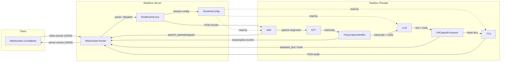
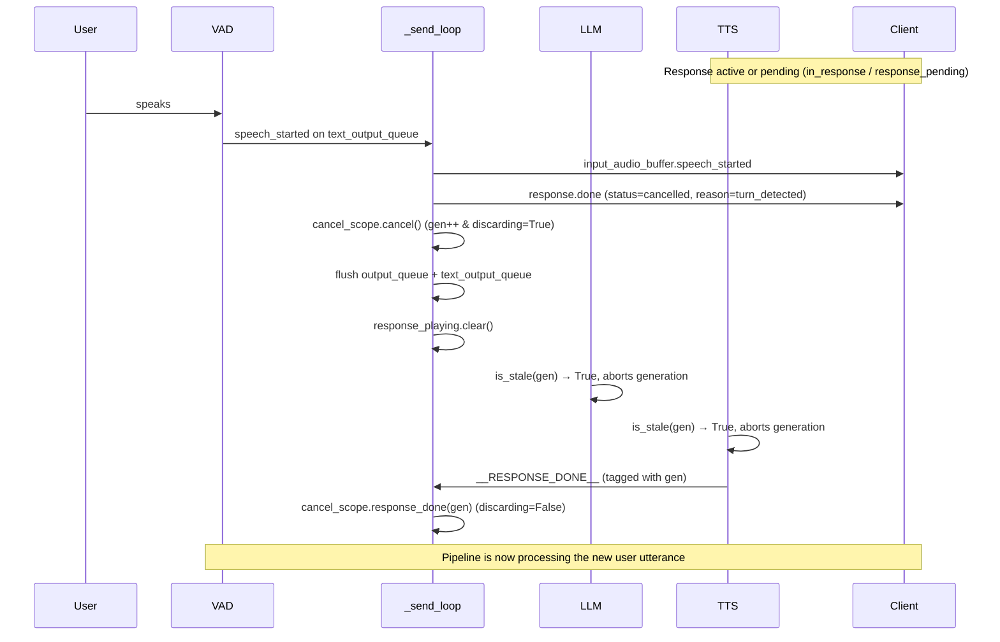

## Realtime Engine -- High-Level Architecture

The server runs as a handler thread inside the existing pipeline. A FastAPI/uvicorn instance serves the WebSocket endpoint at `/v1/realtime`, while the same queue-driven handler chain (VAD, STT, LLM, TTS) processes audio in parallel threads.



**Key flow:**

1. **Inbound audio**: Client sends `input_audio_buffer.append` with base64 PCM. `RealtimeService` decodes, resamples to 16 kHz, splits into 512-sample chunks, and puts them on the `recv_audio_chunks_queue` for VAD.
2. **Speech detection**: VAD detects speech boundaries and emits `speech_started` / `speech_stopped` events on the `text_output_queue`. Full utterance audio goes to STT.
3. **Transcription**: STT output passes through `TranscriptionNotifier`, which taps the transcript for `transcription.delta` / `transcription.completed` events before forwarding to the LLM.
4. **Generation**: The LLM generates text (and optional tool calls). `LMOutputProcessor` splits the output: clean text goes to TTS, and `assistant_text` + tool call dicts go to the `text_output_queue`.
5. **Outbound audio**: TTS writes PCM chunks to `send_audio_chunks_queue`. The router's async `_send_loop` drains both queues, encoding PCM as `response.output_audio.delta` events and translating internal messages into protocol events.
6. **Session config**: `session.update` events deep-merge into `RuntimeConfig`, which is a shared Pydantic model read by VAD (turn detection thresholds), LLM (instructions, tools), and TTS (voice) at processing time.

---

## Supported OpenAI Realtime Events

### Client -> Server

| Event | Description |
|---|---|
| `input_audio_buffer.append` | Stream base64 PCM audio. Decoded, resampled to 16 kHz, and chunked for the VAD. |
| `session.update` | Deep-merge session config (instructions, tools, voice, turn detection, audio format). |
| `conversation.item.create` | Inject `input_text` or `function_call_output` into the LLM context without triggering generation. |
| `response.create` | Trigger LLM generation. Supports per-response `instructions` and `tool_choice` overrides. |
| `response.cancel` | Cancel the in-progress response and re-enable listening. |

### Server -> Client

| Event | Description |
|---|---|
| `session.created` | Sent on connection with current session config. |
| `error` | Protocol errors (`session_limit_reached`, `unknown_or_invalid_event`, `invalid_session_type`, `conversation_already_has_active_response`, etc.) |
| `input_audio_buffer.speech_started` | VAD detected user speech. |
| `input_audio_buffer.speech_stopped` | End of user speech segment. |
| `conversation.item.created` | Acknowledges injected `input_text` from `conversation.item.create`. |
| `conversation.item.input_audio_transcription.delta` | Streaming partial transcript (when live transcription is enabled). |
| `conversation.item.input_audio_transcription.completed` | Final transcript for the user turn (with duration usage). |
| `response.created` | Emitted on the first outbound audio chunk (response is `in_progress`). |
| `response.output_audio.delta` | Base64 PCM audio chunk from TTS. |
| `response.output_audio.done` | Audio stream complete for the current output item. |
| `response.output_audio_transcript.done` | Full assistant text transcript for the turn. |
| `response.function_call_arguments.done` | Tool call with `call_id`, `name`, and JSON `arguments`. |
| `response.done` | Response finished (`completed`, `cancelled` with reason `turn_detected` or `client_cancelled`). |

---

## WebRTC Transport

Alongside the WebSocket endpoint, the server supports the OpenAI GA WebRTC handshake (requires the `webrtc` extra: `pip install 'speech-to-speech[webrtc]'`):

```
POST /v1/realtime/calls        Content-Type: application/sdp
```

The client POSTs an SDP offer and receives an SDP answer (`201`, with a `Location: /v1/realtime/calls/{call_id}` header). Audio then flows over RTP media tracks (Opus at 48 kHz, resampled to and from the 16 kHz pipeline rate with a stateful resampler), while all JSON events use the same protocol as WebSocket mode, carried on the `oai-events` data channel.

A WebRTC session claims a pipeline unit from the same pool as WebSocket clients; the per-unit send loop stays the sole consumer of the pipeline output queues and hands PCM to the transport, which paces it out as 20 ms RTP frames (silence when idle).

Differences from WebSocket mode:

- `input_audio_buffer.append` is rejected with `invalid_event_for_transport` — audio arrives on the media track.
- `output_audio_buffer.clear` is supported (WebRTC only): unplayed audio buffers server-side, so barge-in and cancellation flush it there. The server also flushes it automatically on `response.cancel` and VAD interruption.
- `session.created` is sent when the data channel opens rather than on connection.

ICE servers (STUN/TURN) can be configured via the `SPEECH_TO_SPEECH_ICE_SERVERS` env var, a JSON list of server entries:

```bash
export SPEECH_TO_SPEECH_ICE_SERVERS='[{"urls": "stun:stun.example.com:3478"}, {"urls": "turn:turn.example.com", "username": "u", "credential": "c"}]'
```

Without it, aiortc defaults apply (host candidates + Google STUN). Deployments where clients cannot reach the server directly (symmetric NAT, containers without exposed UDP) need a TURN server.

---

## Tool Calling Design

Tool calling works through two distinct paths depending on the LLM backend, but both converge to the same wire protocol for the client.

### Local LLM path (`LanguageModelHandler` -- transformers / mlx-lm)

Tools defined in `session.update` are converted to `FunctionTool` objects. Each tool's JSON Schema `parameters` are turned into a Python `inspect.Signature` (via `signature_from_schema`), and `to_code_prompt()` renders a human-readable `def name(...): """docstring"""` block.

These tool signatures are injected into the system prompt using a Jinja2 template (`tool_prompt.py`) that instructs the model to wrap tool calls in `<code>...</code>` delimiters:

```
<code>
function_name(arg_name_1=value1, arg_name_2='string_value')
</code>
```

After generation, `_extract_tools` uses a regex to find `<code>` blocks, then `extract_function_calls_from_text` parses each `name(kwargs)` call and validates it against registered tools. Valid calls become `ResponseFunctionToolCall` dicts with generated `call_id`s.

### OpenAI API path (`ResponsesApiModelHandler`)

Tools are passed natively as the `tools=` parameter to `client.responses.create`. The API returns structured `function_call` items directly -- no prompt engineering or regex parsing needed. Per-response `tool_choice` overrides from `response.create` are supported.

### Common output path

Both handlers yield `(text, language_code, tools)` tuples. `LMOutputProcessor` forwards clean text to TTS and puts `{"type": "assistant_text", "text": ..., "tools": [...]}` on the `text_output_queue`. The router's `_send_loop` translates these into:
- `response.output_audio_transcript.done` for the text
- `response.function_call_arguments.done` for each tool call

### Tool result flow

1. Client executes the tool and sends `conversation.item.create` with `type: "function_call_output"` and `output: "<result>"`
2. `RealtimeService` appends the tool output to the chat context and emits `conversation.item.created`; this does not trigger generation.
3. If the tool result needs to be spoken to the user, such as camera/search/data results, the client sends `response.create` to trigger follow-up generation.
4. For fire-and-forget robot actions such as dance, emotion, head movement, stop, or idle tools, the client can stop after `conversation.item.created`; the assistant should already have spoken the natural lead-in before the tool call.

---

## Interruption Handling

Barge-in (user speaks while the assistant is playing audio) is handled cooperatively between the VAD, the `_send_loop`, and the LLM/TTS handlers via a shared `CancelScope` object (`cancel_scope.py`).

### CancelScope design

`CancelScope` replaces the old two-signal pattern (`cancel_response` Event + `discard_stale_output` boolean) with a single object that manages:

- **Generation counter** (`cancel_scope.generation`): pipeline threads (LLM, TTS) capture the current generation at the start of each response and check `cancel_scope.is_stale(gen)` on every streaming token. When `cancel()` is called, the generation increments and all prior generations become stale -- no timing games required.
- **Discard flag** (`cancel_scope.discarding`): set by `cancel()`, checked by the async `_send_loop` to drop output from superseded generations that arrives between `cancel()` and `response_done()`. Cleared by `response_done(generation)` (only when the sentinel's generation matches the discarded or current one -- sentinels from unrelated older generations are ignored), by `new_response()` on an explicit `response.create`, or by `reset()` on session claim/release.

Pipeline output is **generation-tagged**: `AudioOutput` chunks and `AssistantTextEvent`s carry a `cancel_generation` field stamped by the handler that produced them. The send loop's `_generation_is_discardable` drops an item if its generation is stale, or if `discarding` is set and the item is not from the current generation. Output from the *current* generation always passes through, so a fresh response is never swallowed by a lingering discard window (e.g. a superseded speculative turn whose TTS never emitted a `__RESPONSE_DONE__` sentinel).



**Step by step:**

1. **VAD detects speech**: puts a `SpeechStartedEvent` on `text_output_queue`.
2. **`_send_loop` processes text events first** (priority over audio): translates `speech_started` into protocol events. If an active response was in progress, `RealtimeService.dispatch_pipeline_event` emits `response.output_audio.done` + `response.done` with `status="cancelled"` and `reason="turn_detected"`.
3. **Cancel + queue flush**: if a response is active (`in_response`) *or* pending (`response_pending` -- accepted `response.create`, no audio yet), and interrupts are enabled (see step 4), the send loop calls `cancel_scope.cancel()` (increments generation, enables discard), clears `response_pending`, drains `output_queue` (preserving `__RESPONSE_DONE__` sentinels) and `text_output_queue` (preserving user-side events: `speech_stopped`, partial/completed transcriptions, token usage), then clears `response_playing`.
4. **Interrupt gating**: the cancel only fires if the `SpeechStartedEvent.interrupt_response` flag is set *and* the session config allows it (`turn_detection.interrupt_response`, read via `RuntimeConfig.interrupt_response_enabled`, default true). When disabled, user speech during a response is transcribed but the response keeps playing.
5. **LLM/TTS cancellation**: handlers capture `gen = cancel_scope.generation` at the start of each response and check `cancel_scope.is_stale(gen)` on every streaming token, aborting early when stale.
6. **Discard guard**: while `cancel_scope.discarding` is True, the send loop drops audio chunks and assistant text whose `cancel_generation` is not current (see `_generation_is_discardable` above). The guard clears when a `__RESPONSE_DONE__` with a matching generation arrives (via `cancel_scope.response_done(gen)`), or when an explicit `response.create` starts a new response (`cancel_scope.new_response()`).
7. **Client-initiated cancel**: `response.cancel` calls `cancel_scope.cancel()` (only if a response was active), flushes both queues with the same preservation rules, triggers `finish_response(status="cancelled", reason="client_cancelled")`, re-enables `should_listen`, and clears `response_playing`.
8. **Spurious cancel safety**: if no response is active, `cancel_scope.cancel()` is not called, preventing the discard guard from being set without a `__RESPONSE_DONE__` to clear it.

---

## Testing

### Local LLM with Transformers

```bash
uv run speech-to-speech \
  --mode realtime \
  --stt parakeet-tdt \
  --llm_backend transformers \
  --tts kokoro \
  --model_name "Qwen/Qwen3-4B-Instruct-2507" \
  --llm_device mps \
  --llm_torch_dtype float16 \
  --enable_live_transcription
```

### Local LLM with MLX-LM

```bash
uv run speech-to-speech \
  --mode realtime \
  --stt parakeet-tdt \
  --llm_backend mlx-lm \
  --tts kokoro \
  --model_name "mlx-community/Qwen3-4B-Instruct-2507-bf16" \
  --llm_device mps \
  --llm_torch_dtype float16 \
  --enable_live_transcription
```

### Remote LLM with OpenAI-compatible API

```bash
uv run speech-to-speech \
  --mode realtime \
  --stt parakeet-tdt \
  --llm_backend responses-api \
  --tts kokoro \
  --model_name "openai/gpt-oss-20b:groq" \
  --responses_api_base_url "https://router.huggingface.co/v1" \
  --responses_api_api_key "$HF_TOKEN" \
  --responses_api_stream \
  --enable_live_transcription
```
